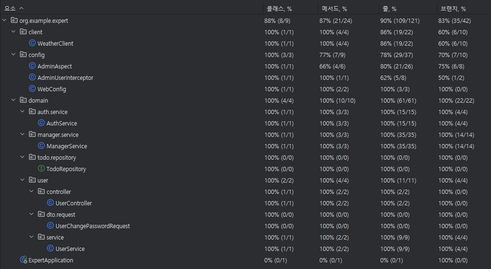

# SPRING ADVANCED
코드 개선 및 테스트 코드 작성

## Git
- main
  - dev 브랜치에서 테스트가 완료될 경우 최종 push
- dev
  - 각 레벨별 기능 구현이 완료되면 push
- lv1
  - 코드 개선 퀴즈 - Early Return
  - 리팩토링 퀴즈 - 불필요한 if-else 피하기
  - 코드 개선 퀴즈 - Validation
- lv2
  - N+1 문제
- lv3
  - 테스트 코드 연습 - 1
  - 테스트 코드 연습 - 2
    - 1번 케이스
    - 2번 케이스
    - 3번 케이스
- lv4
  - Interceptor와 AOP를 활용한 API 로깅
- lv5
  - ‘내’가 정의한 문제와 해결 과정
  - lv5/refactor.md 파일에 정리
- lv6
  - 테스트 커버리지
  - 아래 이미지 첨부

## 테스트 커버리지 

